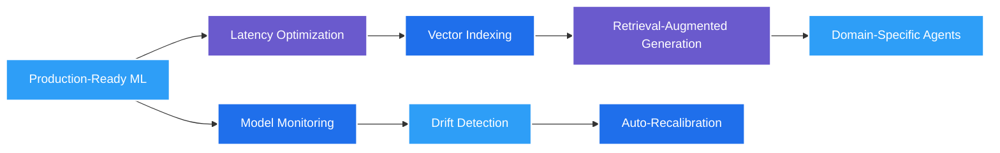

<div align="center">

<h1 style="margin:0;padding:0;">Vishal Ravi</h1>


<p>
  <a href="mailto:dev.vishalravi@gmail.com"></a>
  <a href="https://linkedin.com/in/vishal-ravi07"></a>
  <a href="https://github.com/vishal-ravi"></a>
  <a href="https://vishal-portfolio-psi-orpin.vercel.app"></a>
</p>


</div>

---

## 🚀 Professional Snapshot
Results-driven Python Developer & Data Scientist focused on shipping robust APIs, data/ML pipelines, and intelligent products. I care about clarity in code, measurable impact, and production reliability.

- ⏱ Reduced research workflow time by **30%** via automation & pipeline optimization  
- 🧪 Ensured **99.5% data integrity** for scientific processing  
- 🔁 Boosted system interoperability by **25%** with modular APIs  
- 🧠 Improved curation accuracy by **35%** using NLP relevance scoring  
- 🩺 Delivered **85%+ accuracy** in real-time medical image classification  

<div align="center">
  
</div>

---

## 🧩 Core Strengths
| Area | Focus | Tooling / Approach |
|------|-------|--------------------|
| Machine Learning | Model design, optimization, deployment | TensorFlow, PyTorch, Scikit-learn, HuggingFace |
| Data Engineering | ETL, integrity, automation | Pandas, NumPy, Task Schedulers, Airflow-like patterns |
| API & Backend | RESTful services, performance, auth | FastAPI, Flask, Django, JWT/OAuth2, Observability |
| MLOps | Reproducibility, CI/CD, containers | Docker, GitHub Actions, Versioning, Artifacts |
| Cloud & Infra | Deployment, scalability | AWS (EC2, S3), Vercel, Render, Heroku |
| NLP & CV | Text and vision intelligence | SpaCy, NLTK, Transformers, TensorFlow.js |

---

## 🛠 Tech Stack
<div align="center">

### Languages


### Frameworks


### ML / AI


### Data & Visualization


### Infra & Ops


### Databases


</div>

<details>
<summary><b>🔍 Expanded Stack View</b></summary>
<br>

```text
APIs: OpenAI API · PubMed · Dev.to · NewsData · OAuth2 · JWT
Automation: Shell · PowerShell · Selenium · Task Schedulers
Quality: Test-driven design · Reproducible builds · Version pinning
Security: Auth flows · Input validation · Secrets management
Deployment: Container-first · Immutable artifacts · Rolling strategies
```
</details>

---

## 🧪 Featured Projects

### 🎯 ReqNinja – API Testing & Automation CLI
Open-source toolkit merging curl ergonomics with Python's requests power. Supports retries with exponential backoff, environment profiles, batch execution, rich formatting, and multi-auth strategies.  
- Impact: Accelerates API debugging & scripting workflows  
- Stack: Python, Typer, Rich, Requests, Packaging, GitHub Actions  
- Repo: https://github.com/vishal-ravi/reqninja

### 🔬 Biocue – Intelligent Research Curation
NLP pipeline for PubMed ingestion, relevance scoring, keyword extraction & topic grouping improving curation accuracy by **35%**.  
- Stack: Python, Scikit-learn, SpaCy, NLTK, PubMed API

### 🩺 Dermalens – Real-Time Skin Lesion Classifier
In-browser ML with TensorFlow.js + MobileNet for early-stage lesion assessment (> **85%** indicative accuracy).  
- Stack: JavaScript, TensorFlow.js, MobileNet, HTML5/CSS3

### 🧠 Resume Evaluator (LLM-Powered)
Automated candidate evaluation with semantic scoring & role-fit heuristics reducing screening time by **60%**.  
- Stack: Python, LangChain, OpenAI API, Streamlit

### 💬 Mental Health Sentiment Assistant
Hybrid LLM + sentiment engine providing contextual response routing and resource suggestions.  
- Stack: Python, LangChain, OpenAI API, Sentiment Models

### 📈 Sales Forecasting & Analytics
Time-series modeling + exploratory dashboards improved inventory turnover by **10%**.  
- Stack: Python, Pandas, Scikit-learn, Matplotlib, Seaborn

### 🧬 Variant Data Explorer (In Development)
FastAPI + MongoDB platform for genomic variant filtering, pagination & interactive visual distribution charts.  
- Stack: FastAPI, Tailwind CSS, MongoDB, Chart.js

### 💰 FinSmart AI (In Development)
Personal finance intelligence: expense extraction, budgeting heuristics, receipt OCR & conversational insights.  
- Stack: React Native, TypeScript, OpenAI API, Firebase, Vision APIs

---

## 🔄 Focus & Roadmap


---

## 📊 GitHub Analytics
<div align="center">
  
  
</div>

<div align="center">
  
</div>

<div align="center">
  
</div>

---

## 🤝 Collaboration
- Open to building ML tooling, data platforms & intelligent automation solutions  
- Preference for clean architecture, explicit contracts & reproducible environments  
- Emphasis on observability, validation & iterative refinement  
- Exploring vector stores, agent frameworks & real-time inference

---

## 📬 Contact & Availability
<div align="center">

**Email:** dev.vishalravi@gmail.com · **Location:** Kerala, India  
**LinkedIn:** https://linkedin.com/in/vishal-ravi07 · **Portfolio:** https://vishal-portfolio-psi-orpin.vercel.app

<a href="https://github.com/vishal-ravi?tab=repositories"></a>
<a href="mailto:dev.vishalravi@gmail.com"></a>

</div>
