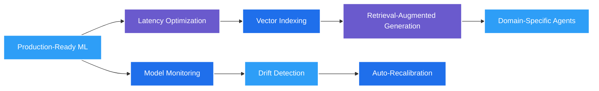

# ⚡ Vishal Ravi

<div align="center">
  

  

  <p>
    <a href="mailto:dev.vishalravi@gmail.com"></a>
    <a href="https://linkedin.com/in/vishal-ravi07"></a>
    <a href="https://github.com/vishal-ravi"></a>
    <a href="https://vishal-portfolio-psi-orpin.vercel.app"></a>
  </p>

  
</div>

---

## 🚀 Professional Snapshot
Results-driven Python Developer & Data Scientist focused on translating data and models into performant, production-grade systems. I design resilient APIs, automated data/ML pipelines, and intelligent services that improve efficiency, accuracy, and scalability.

**Impact Highlights:**
- ⏱ Reduced research workflow processing time by **30%** via automation & optimized pipelines.
- 🧪 Achieved **99.5% data integrity** in scientific processing environments.
- 🔄 Increased backend interoperability by **25%** through modular API architecture.
- 🧠 Improved literature curation accuracy by **35%** using NLP relevance scoring.
- 🩺 Delivered **85%+ model accuracy** for real-time medical image classification.

---

## 🧩 Core Strengths
| Area | Focus | Tooling / Approach |
|------|-------|--------------------|
| Machine Learning | Model design, optimization, deployment | TensorFlow, PyTorch, Scikit-learn, HuggingFace |
| Data Engineering | ETL, cleansing, integrity, automation | Pandas, NumPy, FastAPI, Task Schedulers |
| API & Backend | RESTful services, performance, security | FastAPI, Flask, Django, Auth, Observability |
| MLOps | Reproducibility, CI/CD, containerization | Docker, GitHub Actions, Versioning, Artifacts |
| Cloud & Infra | Deployment, scalability, reliability | AWS (EC2, S3), Vercel, Render, Heroku |
| NLP & CV | Text & vision intelligence pipelines | SpaCy, NLTK, Transformers, TensorFlow.js |

---

## 🛠 Tech Stack (Condensed)
<div align="center">

**Languages**  
   

**Frameworks**  
    

**ML / AI**  
    

**Data & Viz**  
     

**Infra & Ops**  
    

**Databases**  
   

</div>

<details>
<summary><b>🔍 Expanded Stack View</b></summary>
<br>

```text
APIs: OpenAI API · PubMed · Dev.to · NewsData · OAuth2 · JWT
Automation: Shell · PowerShell · Selenium · Task Schedulers
Quality: Test-driven design · Reproducible builds · Version pinning
Security: Auth flows · Input validation · Secrets management
Deployment: Container-first · Immutable artifacts · Rolling strategies
```
</details>

---

## 🧪 Featured Projects

### 🎯 ReqNinja – API Testing & Automation CLI
Open-source toolkit merging curl ergonomics with Python's requests power. Supports retries with exponential backoff, environment profiles, batch execution, rich formatting, and multi-auth strategies.
- Impact: Accelerates API debugging & scripting workflows.
- Stack: Python, Typer, Rich, Requests, Packaging, GitHub Actions
- Repo: [github.com/vishal-ravi/reqninja](https://github.com/vishal-ravi/reqninja)

### 🔬 Biocue – Intelligent Research Curation
NLP pipeline for PubMed ingestion, relevance scoring, keyword extraction & topic grouping improving curation accuracy by **35%**.
- Stack: Python, Scikit-learn, SpaCy, NLTK, PubMed API

### 🩺 Dermalens – Real-Time Skin Lesion Classifier
In-browser ML with TensorFlow.js + MobileNet for early-stage lesion assessment (> **85%** indicative accuracy).
- Stack: JavaScript, TensorFlow.js, MobileNet, HTML5/CSS3

### 🧠 Resume Evaluator (LLM-Powered)
Automated candidate evaluation with semantic scoring & role-fit heuristics reducing screening time by **60%**.
- Stack: Python, LangChain, OpenAI API, Streamlit

### 💬 Mental Health Sentiment Assistant
Hybrid LLM + sentiment engine providing contextual response routing and resource suggestions.
- Stack: Python, LangChain, OpenAI API, Sentiment Models

### 📈 Sales Forecasting & Analytics
Time-series modeling + exploratory dashboards improved inventory turnover by **10%**.
- Stack: Python, Pandas, Scikit-learn, Matplotlib, Seaborn

### 🧬 Variant Data Explorer (In Development)
FastAPI + MongoDB platform for genomic variant filtering, pagination & interactive visual distribution charts.
- Stack: FastAPI, Tailwind CSS, MongoDB, Chart.js

### 💰 FinSmart AI (In Development)
Personal finance intelligence: expense extraction, budgeting heuristics, receipt OCR & conversational insights.
- Stack: React Native, TypeScript, OpenAI API, Firebase, Vision APIs

---

## 🔄 Current Focus & Roadmap


---

## 📊 GitHub Analytics
<div align="center">
  
  
</div>
<div align="center">
  
</div>
<div align="center">
  
</div>

---

## 🤝 Community & Collaboration
- 🧩 Open to building ML tooling, data platforms & intelligent automation solutions.
- 💬 Prefer clean architecture, explicit contracts & reproducible environments.
- 🛡 Emphasis on observability, validation & iterative refinement.
- 🌱 Continuously exploring vector stores, agent frameworks & real-time inference.

---

## 📬 Contact & Availability
<div align="center">

**Email:** dev.vishalravi@gmail.com · **Location:** Kerala, India  
**LinkedIn:** [linkedin.com/in/vishal-ravi07](https://linkedin.com/in/vishal-ravi07) · **Portfolio:** [vishal-portfolio-psi-orpin.vercel.app](https://vishal-portfolio-psi-orpin.vercel.app)

<a href="https://github.com/vishal-ravi?tab=repositories"></a>
<a href="mailto:dev.vishalravi@gmail.com"></a>

</div>

---

<div align="center">
  
  <p><i>"Precision in data. Clarity in code. Impact in production." </i></p>
</div>
