<!-- 🚀 Advanced GitHub Profile with Modern Animations 🚀 -->

  

<!-- 🎯 Advanced Animated Introduction -->

  

<!-- 🎨 Advanced Modern Avatar Section -->

  

<!-- 🎪 Advanced Animated Contact Badges -->

  
  
  
  

<!-- 📊 Advanced Animated Stats Section -->

  
  
  
  

<!-- 🐍 Advanced Animated Snake -->

  

<!-- 🎭 Advanced Animated About Section -->

##  About Me

📍 **Location:** Kerala, India  
📧 **Email:** dev.vishalravi@gmail.com   
🔗 **Links:** [LinkedIn](https://linkedin.com/in/vishal-ravi07) | [Portfolio](https://vishal-portfolio-psi-orpin.vercel.app/)

**Python Developer & Data Scientist** with extensive experience in **data analysis**, **machine learning**, and **artificial intelligence**.

Specializing in **predictive modeling**, **data visualization**, and **automated data pipelines** with a strong foundation in **Python programming**, **statistical analysis**, and **deep learning**.

**Core Expertise:** Building intelligent, data-driven solutions that solve complex business problems through advanced analytics, machine learning algorithms, and automated data processing systems.

---

<!-- 🛠️ Advanced Animated Tech Stack -->

##  Tech Stack

### 🎯 **Core Technologies Overview**

<table>
<tr>
<td width="33%" align="center">

#### 🚀 **Programming Languages**

**Core Languages for Development**

</td>
<td width="33%" align="center">

#### 🌐 **Web Development**

**Full-Stack Development**

</td>
<td width="33%" align="center">

#### 🤖 **AI & Machine Learning**

**Advanced AI Solutions**

</td>
</tr>
</table>

### 📊 **Data Science & Analytics**

<table>
<tr>
<td width="50%" align="center">

#### 📈 **Data Processing & Analysis**

**Data Manipulation & NLP**

</td>
<td width="50%" align="center">

#### 📊 **Data Visualization & BI**

**Interactive Dashboards**

</td>
</tr>
</table>

### 🏗️ **Infrastructure & DevOps**

<table>
<tr>
<td width="50%" align="center">

#### ☁️ **Cloud & Deployment**

**Scalable Cloud Solutions**

</td>
<td width="50%" align="center">

#### 🗄️ **Databases**

**Data Storage Solutions**

</td>
</tr>
</table>

### 🛠️ **Tools & Automation**

<table>
<tr>
<td width="33%" align="center">

#### 🔌 **APIs & Integration**

**API Development & Testing**

</td>
<td width="33%" align="center">

#### 🎯 **Development Tools**

**Development Environment**

</td>
<td width="33%" align="center">

#### 🤖 **Automation**

**Process Automation**

</td>
</tr>
</table>

### 💻 **Operating Systems**

**Multi-Platform Development**

### 🎨 **Tech Stack Summary**

| **Category** | **Technologies** | **Expertise Level** |
|--------------|------------------|---------------------|
| 🚀 **Programming** | Python, Java, JavaScript, SQL, Bash | Expert |
| 🌐 **Web Development** | Flask, Django, FastAPI, React, HTML5, CSS3 | Advanced |
| 🤖 **AI/ML** | TensorFlow, PyTorch, Scikit-learn, HuggingFace | Expert |
| 📊 **Data Science** | Pandas, NumPy, Matplotlib, Seaborn, Plotly | Expert |
| ☁️ **Cloud & DevOps** | AWS, Docker, GitHub Actions, Heroku, Render | Advanced |
| 🗄️ **Databases** | MySQL, PostgreSQL, MongoDB, SQLite, SQL Server | Advanced |
| 🛠️ **Tools** | VS Code, Jupyter, Postman, Selenium | Advanced |

---

<!-- 📊 Advanced Performance Metrics -->

##  Performance Metrics

| **Skill Category** | **Technologies** | **Proficiency** | **Status** |
|-------------------|------------------|-----------------|------------|
| 🐍 **Python Development** | Python, Flask, Django, FastAPI, Streamlit |  | 🟢 Active |
| 🤖 **Machine Learning** | TensorFlow, PyTorch, Scikit-learn, NLTK, SpaCy, HuggingFace |  | 🟢 Active |
| 📊 **Data Analysis** | Pandas, NumPy, Matplotlib, Seaborn, Plotly |  | 🟢 Active |
| 🌐 **Web Development** | Flask, Django, FastAPI, React, HTML5, CSS3 |  | 🟢 Active |
| 🗄️ **Database Systems** | MySQL, PostgreSQL, MongoDB, SQLite, SQL Server |  | 🟢 Active |
| ☁️ **Cloud & DevOps** | AWS, Docker, GitHub Actions, Heroku, Render, Vercel |  | 🟢 Active |
| 🔌 **APIs & Integration** | RESTful APIs, OpenAI API, Postman |  | 🟢 Active |
| 🛠️ **Automation & Tools** | Shell Scripting, PowerShell, Selenium, Jupyter, VS Code |  | 🟡 Learning |

---

<!-- 📈 Advanced GitHub Stats -->

##  GitHub Stats

  
  

<!-- 🎯 Advanced Commit Streak -->

  

<!-- 📊 Advanced Contribution Graph -->

  

### 📈 **Contribution Overview**

| **Metric** | **Value** | **Status** |
|------------|-----------|------------|
| 🎯 **Total Contributions** | 1,500+ | 🟢 Active |
| 📅 **Current Streak** | 45 days | 🟢 Active |
| 🏆 **Longest Streak** | 120 days | 🟢 Achieved |
| 📊 **Average Daily** | 3.2 commits | 🟢 Consistent |
| 🌟 **Repository Stars** | 25+ | 🟢 Growing |
| 🤝 **Pull Requests** | 50+ | 🟢 Active |

---

<!-- 🏆 Advanced Achievements -->

##  Achievements & Certifications

### 🎓 **Professional Certifications**

<table>
<tr>
<td width="50%" align="center">

#### 🏆 **Completed Certifications**

**✅ Python for Data Science - IBM**  
*Completed: December 2023*  
**✅ Machine Learning Fundamentals**  
*Completed: November 2023*  
**✅ Data Analysis with Python**  
*Completed: October 2023*  
**✅ SQL for Data Science**  
*Completed: September 2023*

</td>
<td width="50%" align="center">

#### 🎯 **In Progress & Planned**

**🔄 TensorFlow Developer Certificate**  
*Expected: March 2025*  
**🔄 Deep Learning Specialization - Coursera**  
*Expected: May 2025*  
**⏳ AWS Machine Learning Specialty**  
*Planned: July 2025*  
**⏳ Google Data Analytics Professional**  
*Planned: September 2025*

</td>
</tr>
</table>

### 🏅 **Additional Achievements**

<table>
<tr>
<td width="33%" align="center">

#### 🎖️ **Academic Excellence**
- **Dean's List** - Top 10% of graduating class
- **Research Publication** - AI/Healthcare domain
- **Hackathon Winner** - Data Science competition
- **Technical Speaker** - University tech events

</td>
<td width="33%" align="center">

#### 🚀 **Professional Milestones**
- **200+ GitHub Repositories** created
- **50+ Open Source Contributions**
- **15+ Data Science Projects** completed
- **5+ Machine Learning Models** deployed

</td>
<td width="33%" align="center">

#### 🌟 **Community Impact**
- **Mentored 50+** aspiring developers
- **Technical Blog** - 100+ articles published
- **Open Source Maintainer** - 3 active projects
- **Community Speaker** - 10+ tech talks

</td>
</tr>
</table>

### 📈 **Certification Progress**

| **Certification** | **Status** | **Progress** | **Expected Completion** |
|-------------------|------------|--------------|-------------------------|
| 🐍 **TensorFlow Developer** | 🔄 In Progress |  | March 2025 |
| 🧠 **Deep Learning Specialization** | 🔄 In Progress |  | May 2025 |
| ☁️ **AWS ML Specialty** | ⏳ Planned |  | July 2025 |
| 📊 **Google Data Analytics** | ⏳ Planned |  | September 2025 |

---

<!-- 🎯 Advanced Current Focus -->

##  Current Focus

<table>
<tr>
<td width="50%" align="center">

### 🚀 **Advanced Machine Learning**

**🔬 Deep Learning & Neural Networks**  
**🧠 Natural Language Processing**  
**🤖 Computer Vision & Image Recognition**  
**📊 Model Optimization & Deployment**

</td>
<td width="50%" align="center">

### 📊 **Data Analysis & Visualization**

**📈 Statistical Analysis & Modeling**  
**🎨 Interactive Dashboards & Reports**  
**🔍 Exploratory Data Analysis**  
**📋 Data Pipeline Automation**

</td>
</tr>
<tr>
<td width="50%" align="center">

### 🤖 **AI/ML Engineering**

**🏗️ Model Deployment & Scaling**  
**⚡ MLOps & Pipeline Automation**  
**🔄 Real-time Data Processing**  
**🔒 Production ML Systems**

</td>
<td width="50%" align="center">

### 🌐 **Web Development**

**🎯 Full-stack Applications**  
**🔌 RESTful API Development**  
**⚡ High-performance Web Services**  
**🎨 Modern UI/UX Design**

</td>
</tr>
</table>

### 🎯 **Current Learning Path**

```mermaid
graph LR
    A[🔬 Advanced ML<br/>TensorFlow & PyTorch<br/>Deep Learning & NLP] --> B[🤖 MLOps<br/>Docker & Kubernetes<br/>CI/CD & Automation]
    B --> C[🌐 Web Development<br/>Flask & Django<br/>Full-stack & APIs]
    C --> D[📊 Data Engineering<br/>Spark & Airflow<br/>Big Data & Pipelines]
    D --> E[🚀 Production Deployment<br/>AWS & CI/CD<br/>Cloud & Scaling]
    
    %% Enhanced styling with modern colors and design
    style A fill:#667eea,stroke:#ffffff,stroke-width:4px,color:#ffffff,font-weight:bold,font-size:14px,stroke-dasharray: 5 5
    style B fill:#764ba2,stroke:#ffffff,stroke-width:4px,color:#ffffff,font-weight:bold,font-size:14px,stroke-dasharray: 5 5
    style C fill:#667eea,stroke:#ffffff,stroke-width:4px,color:#ffffff,font-weight:bold,font-size:14px,stroke-dasharray: 5 5
    style D fill:#764ba2,stroke:#ffffff,stroke-width:4px,color:#ffffff,font-weight:bold,font-size:14px,stroke-dasharray: 5 5
    style E fill:#667eea,stroke:#ffffff,stroke-width:4px,color:#ffffff,font-weight:bold,font-size:14px,stroke-dasharray: 5 5
    
    %% Enhanced edge styling with animated-like appearance
    linkStyle default stroke:#667eea,stroke-width:4px,stroke-dasharray: 8 4
```

### 🎨 **Visual Learning Journey**

<table>
<tr>
<td width="20%" align="center">

#### 🔬 **Phase 1: Advanced ML**
**TensorFlow & PyTorch**

**✅ Deep Learning Fundamentals**  
**✅ Neural Network Architecture**  
**🔄 Advanced NLP Techniques**  
**⏳ Computer Vision Projects**

</td>
<td width="20%" align="center">

#### 🚀 **Phase 2: MLOps**
**Docker & Kubernetes**

**✅ Container Orchestration**  
**✅ CI/CD Pipelines**  
**🔄 Model Versioning**  
**⏳ Production Deployment**

</td>
<td width="20%" align="center">

#### 🌐 **Phase 3: Web Dev**
**Flask & Django**

**✅ Full-stack Applications**  
**✅ RESTful APIs**  
**🔄 Real-time Applications**  
**⏳ Microservices Architecture**

</td>
<td width="20%" align="center">

#### 📊 **Phase 4: Data Engineering**
**Spark & Airflow**

**✅ Big Data Processing**  
**✅ Data Pipeline Design**  
**🔄 Real-time Streaming**  
**⏳ Data Lake Architecture**

</td>
<td width="20%" align="center">

#### 🚀 **Phase 5: Production**
**AWS & CI/CD**

**✅ Cloud Infrastructure**  
**✅ Auto-scaling Systems**  
**🔄 Monitoring & Logging**  
**⏳ Enterprise Solutions**

</td>
</tr>
</table>

### 🎯 **Learning Progress Overview**

| **Phase** | **Status** | **Progress** | **Next Milestone** |
|-----------|------------|--------------|-------------------|
| 🔬 **Advanced ML** | 🟢 Active |  | Computer Vision Projects |
| 🤖 **MLOps** | 🟡 Learning |  | Production Deployment |
| 🌐 **Web Development** | 🟢 Active |  | Microservices Architecture |
| 📊 **Data Engineering** | 🟡 Learning |  | Real-time Streaming |
| 🚀 **Production** | 🟡 Planning |  | Enterprise Solutions |

---

<!-- 🏆 Advanced Achievements -->

##  Achievements & Certifications

  

🎓 **Professional Certifications:**
- **TensorFlow Developer Certificate** (In Progress)
- **AWS Machine Learning Specialty** (Planned)
- **Google Data Analytics Professional Certificate** (Planned)
- **Python for Data Science - IBM** (Completed)
- **Machine Learning Fundamentals** (Completed)
- **Deep Learning Specialization - Coursera** (In Progress)

---

<!-- 📞 Advanced Contact Section -->

##  Contact & Support

### **Let's Connect!**

### **Support My Work**

---

### ⭐ If you find my repositories useful, please consider starring them! ⭐
### 💡 Always open for collaboration, freelance projects, and innovative opportunities!
### 🐍 Python Developer & Data Scientist
### 🤖 AI/ML Engineer & Machine Learning Expert
### 📊 Data Analytics & Visualization Specialist
### 🔬 Research & Development Engineer

