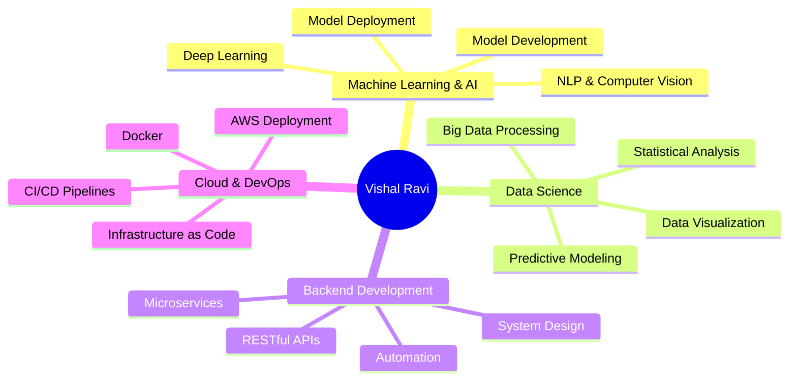

  
# 👋 Hi, I'm Vishal Ravi

  
  
  
  

  

---

## 🚀 Professional Summary

Results-driven **Python Developer** and **Data Scientist** with **1+ years** of experience in developing scalable web applications, data pipelines, and machine learning solutions. Proven expertise in the Python ecosystem (pandas, NumPy, scikit-learn, TensorFlow), RESTful API development, and cloud deployment.

### 📊 Key Achievements:
- ⚡ **30% reduction** in processing time through automation
- 📈 **20% increase** in data accuracy through optimization
- 🎯 **99.5% data integrity** in large-scale scientific datasets
- 🚀 **25% improvement** in system interoperability

---

## 💼 Core Competencies

---

## 🛠️ Technical Skills

### Programming Languages

### Web Frameworks

### Data Science & ML

### Databases

### Cloud & DevOps

### Data Visualization

---

## 💼 Professional Experience

### 🔬 Python Developer & Data Scientist
**CIODS, Mangalore** | *Aug 2024 – Present*

- ⚡ Automated research workflows, reducing processing time by **30%**
- 🔧 Engineered terminal automation tools for data processing pipelines
- 🌐 Designed scalable RESTful APIs, increasing interoperability by **25%**
- 📊 Analyzed large datasets with **99.5% data integrity**
- 🚀 Led full software lifecycle with Docker and AWS deployment

### 📊 Data Science Intern
**CIODS, Mangalore** | *Sept 2023 – Oct 2023*

- 🔄 Developed automated ETL pipelines, improving consistency by **25%**
- 🔐 Configured Windows Active Directory with secure authentication
- 📁 Deployed file organization systems, reducing workload by **40%**
- 🤝 Prepared structured datasets for ML workflows

---

## 🚀 Featured Projects

### [🎯 ReqNinja](https://github.com/vishal-ravi/reqninja) - Python Package & CLI for API Testing
Open-source Python package combining curl simplicity with requests library power
- **Tech Stack:** Python, Requests, Typer, Rich, PyPI
- **Features:** Retries, JSON output, authentication, batch mode
- **Status:** Published on PyPI ✅

---

### 🔬 Biocue - Research Paper Curation Tool
Automated PubMed article filtering using advanced NLP
- **Impact:** **35% accuracy improvement** in literature curation
- **Tech Stack:** Python, PubMed API, NLTK, SpaCy, Scikit-learn

---

### 🏥 Dermalens - AI-Powered Skin Cancer Detection
Real-time skin lesion classification web app
- **Accuracy:** **85%+** detection rate
- **Tech Stack:** TensorFlow.js, MobileNet, HTML5/CSS3

---

### 💼 Resume Evaluator using LLMs
Intelligent resume screening with GPT-based models
- **Impact:** **60% reduction** in screening time
- **Tech Stack:** Python, LangChain, OpenAI API, Streamlit

---

### 🧠 Mental Health Sentiment Analyzer
Hybrid AI solution with empathetic conversations
- **Tech Stack:** Python, LangChain, OpenAI API, Streamlit

---

### 📈 Sales Data Analysis & Forecasting
Comprehensive EDA and predictive modeling
- **Impact:** **10% improvement** in inventory turnover
- **Tech Stack:** Python, Pandas, Scikit-learn, Matplotlib

---

## 🔧 Projects in Development

### 💰 FinSmart AI - Personal Finance & Wealth Manager
AI-powered personal finance application
- **Features:** Expense tracking, budget management, AI advice
- **Tech Stack:** React Native, Redux, Firebase, OpenAI API, Google Cloud Vision

### 🧬 Variant Data Explorer - Genetic Variant Analysis Tool
Web application for genetic variant data exploration
- **Features:** Server-side pagination, advanced filtering, CSV export
- **Tech Stack:** Python, FastAPI, MongoDB, Tailwind CSS, Chart.js

---

## 📊 GitHub Statistics

  
  

  

  

---

## 🎓 Education

**Bachelor of Engineering in Computer Science & Engineering**  
Visvesvaraya Technological University (VTU) | *Oct 2020 – Jun 2024*  
**GPA:** 7.8/10

**Relevant Coursework:** Machine Learning, Data Mining, Data Structures & Algorithms, Database Systems, Computer Networks, Operating Systems, Information Retrieval, Image Processing

---

## 📜 Certifications

- ✅ **Python Programming Fundamentals** - Online Course (2024)
- ✅ **Machine Learning with Python** - DataCamp (2024)
- ✅ **AWS Cloud Practitioner Essentials** - AWS Training (2024)

---

## 🎯 Areas of Expertise

`Machine Learning` • `Deep Learning` • `Data Analysis` • `Data Visualization` • `Backend Development` • `Cloud Computing` • `Natural Language Processing` • `Computer Vision` • `MLOps` • `API Development` • `System Administration` • `Bioinformatics` • `Time Series Forecasting`

---

## 📫 Contact Me

📧 **Email:** dev.vishalravi@gmail.com  
📱 **Phone:** +91 9495894825  
📍 **Location:** Kasaragod, Kerala, India

---

  
### 💡 Open to Opportunities

**Full-time Positions** • **Freelance Projects** • **Technical Collaborations** • **Open Source Contributions**

